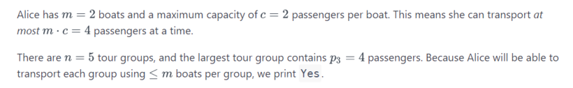
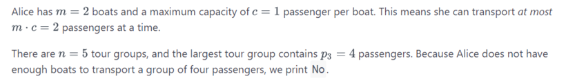

[Alice and Boat Trips](https://www.hackerrank.com/contests/may-jun-2023-ccc-lbrce-coding-practice-open/challenges/alice-and-boat-trips/problem)

**Problem Statement**
---
Alice owns a company that transports tour groups between two islands. She has n trips booked, and each trip has pi passengers. Alice has m boats for transporting people, and each boat's maximum capacity is c passengers.

Given the number of passengers going on each trip, determine whether or not Alice can perform all n trips using no more than m boats per individual trip. If this is possible, print Yes; otherwise, print No.

**Input Format**

The first line contains three space-separated integers describing the respective values of n (number of trips), c (boat capacity), and m (total number of boats). The second line contains n space-separated integers describing the values of p0, p1, p2... pn-1

**Constraints**

1 <= n,c,m <= 100 1 <= pi <= 100

**Output Format**

Print Yes if Alice can perform all n booked trips using no more than m boats per trip; otherwise, print No.

**Sample Input 0**

```
5 2 2
1 2 1 4 3
```

**Sample Output 0**

```
Yes
```

**Explanation 0**



**Sample Input 1**

```
5 1 2
1 2 1 4 1
```

**Sample Output 1**

```
No
```

**Explanation 1**


